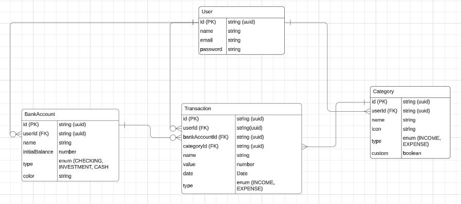
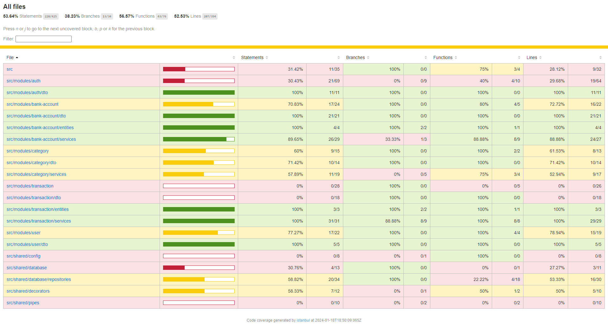
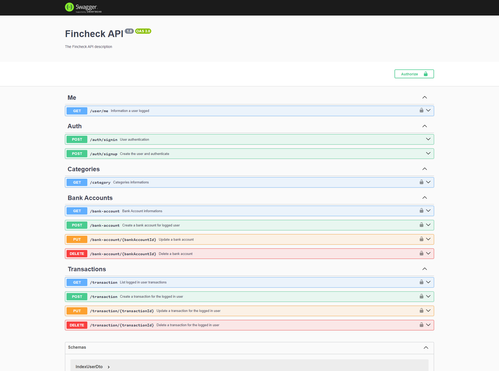

# Backend

This is the fincheck backend.

## Database

The database used was Postgres together with Prisma ORM.

<p align="center">
    
</p>

## Design Pattern

<ul>
    <li>Repository Pattern</li>
    <li>Service Layer Pattern</li>
</ul>

## Tests

Unit tests were carried out using jest focusing on controllers and services

<p align="center">
    
</p>

## Swagger Documentation

Documentation of the endpoints, swagger was used, as there is an integration with nest, facilitating documentation

<p align="center">
    
</p>

## How to use?

To use the application it is recommended to have docker installed, so it is not necessary to install the database and other utilities found in the docker-compose file.

Clone this project on your favorite dir and change to backend dir:

```console
cd backend
```

Edit the .env.example file to .env and put the necessary environment variables.

```console
cp .env.example .env
```

Start the dockers containers.

```console
docker-compose up -d
```

Change env of DB_HOST to "localhost"

Run the migrates to create the tables in the database

```console
npx prisma migrate dev
```

Run to ensure that categories will be included

```console
npx prisma db seed  
```

Change env of DB_HOST to "fincheck-db" (container name inside docker-compose.yml)

Restart docker container:

```console
docker compose down && docker compose up -d
```
 
The application was available in

```console
http://localhost:3000/
```