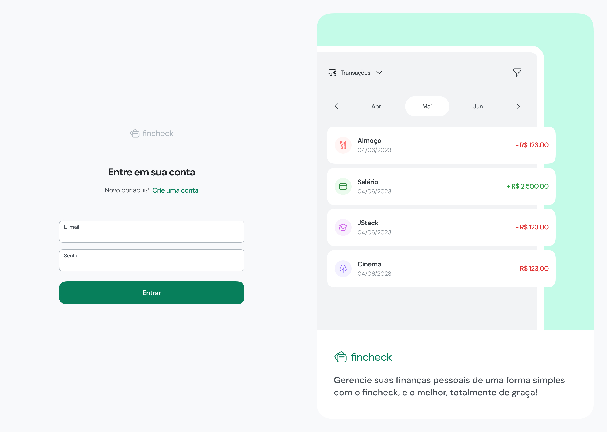
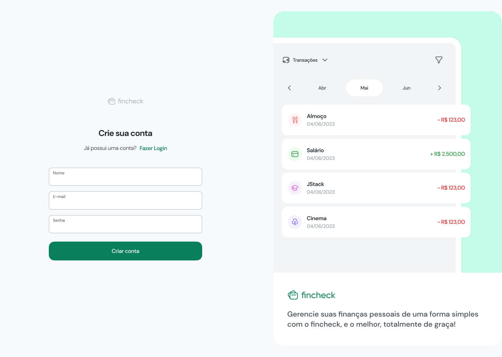
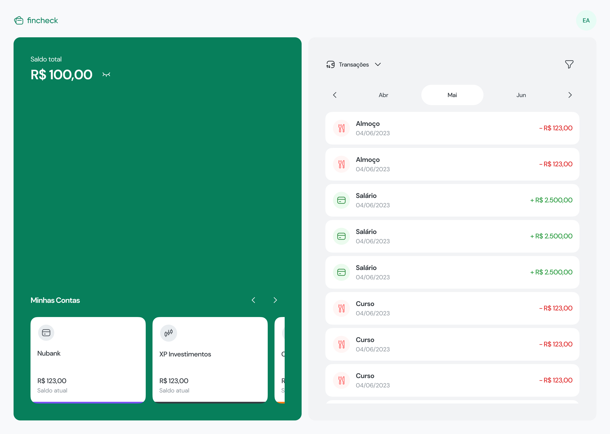
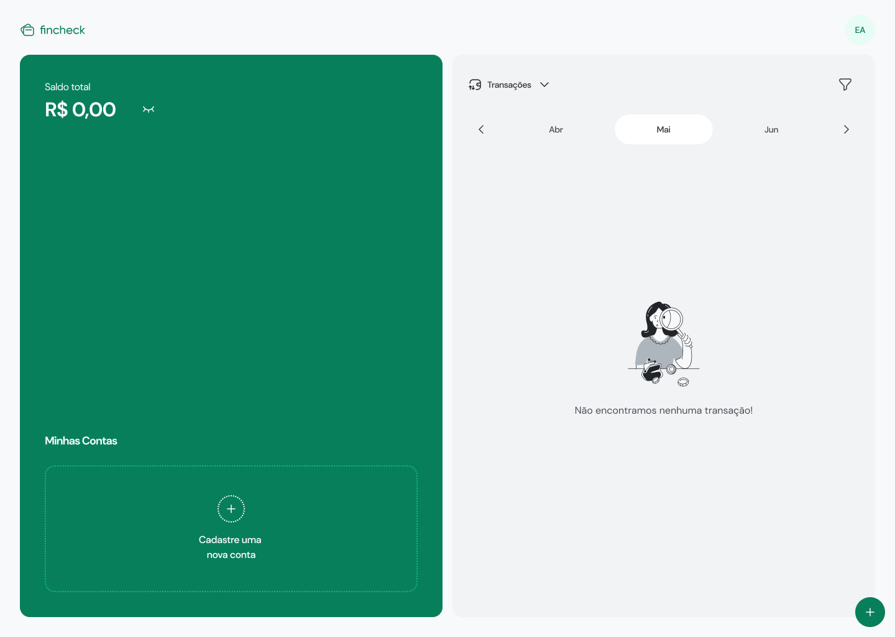

# Frontend

This is the fincheck frontend.

## Screenshots

Here you can have a preview of the screens. The application design can be accessed [here](https://www.figma.com/file/0j4Z5jo3BATqfTLtJxvFLA/Fincheck?type=design&node-id=229-8335&mode=design). Below you will find some screenshots of the application

## Sign In

Login screen.



## Sign Up

Registration screen.



## Dashboard

Here the user will have access to all the application's features



## Dashboard Empty State

Here you can see how the application looks without transactions and accounts.



## How to use?

Clone this project on your favorite dir and change to frontend dir:

```console
cd frontend
```

Make a copy of the .env

```console
cp .env.example .env
```
Change env of VITE_API_URL to: http://localhost:3000

Start the dockers containers.

```console
docker-compose up -d
```

The application was available in

```console
http://localhost:3001/
```